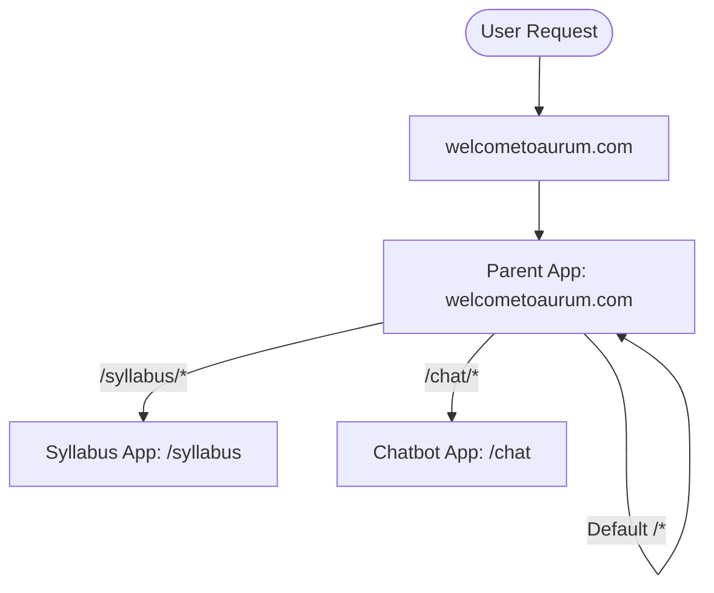

# Welcometoaurum - App Integration & Access Control Guide

This guide details how to integrate your **Main Landing App** (welcometoaurum), **Course Syllabus App**, and **Chatbot Assistant App** into a unified domain using **Vercel Multi-Zones** and secure **Cookie-Based Authentication**.

---

## 1. Architecture Overview (Vercel Multi-Zones)

Using Multi-Zones, all three apps are deployed as separate, independent Vercel projects, but they are mapped to the same single domain (`welcometoaurum.com`) via dynamic path proxying.



*   **Primary Domain (`welcometoaurum.com`):** Mapped to the Parent App (welcometoaurum).
*   **Syllabus Sub-Path (`/syllabus`):** Proxy-routed to the Syllabus App.
*   **Chatbot Sub-Path (`/chat`):** Proxy-routed to the Chatbot App.

---

## 2. Step-by-Step Configuration

### Step A: Configure the Syllabus App (Child Zone)
The Syllabus App must expect to be served from `/syllabus`. 

In `/Users/kd5000/Documents/Aurum Education Portal/next.config.js`, set `basePath`:

```javascript
/** @type {import('next').NextConfig} */
const nextConfig = {
  reactStrictMode: true,
  basePath: '/syllabus', // Matches the routing path on the main domain
  eslint: {
    ignoreDuringBuilds: true,
  },
};

export default nextConfig;
```

### Step B: Configure the Chatbot App (Child Zone)
The Chatbot App must expect to be served from `/chat`.

In its own `next.config.js`, set `basePath`:

```javascript
/** @type {import('next').NextConfig} */
const nextConfig = {
  reactStrictMode: true,
  basePath: '/chat', // Matches the chatbot path
};

module.exports = nextConfig;
```

### Step C: Configure the Main Landing App (Parent Zone)
The Main App serves as the reverse proxy gateway. It intercepts incoming traffic to `/syllabus` or `/chat` and forwards it to the Vercel deployments.

In the Main App's `next.config.js`, add `rewrites`:

```javascript
/** @type {import('next').NextConfig} */
const nextConfig = {
  reactStrictMode: true,
  async rewrites() {
    return [
      {
        source: '/syllabus/:path*',
        destination: 'https://aurum-syllabus-project.vercel.app/syllabus/:path*',
      },
      {
        source: '/chat/:path*',
        destination: 'https://aurum-chatbot-project.vercel.app/chat/:path*',
      },
    ];
  },
};

module.exports = nextConfig;
```

*(Note: Replace `https://aurum-syllabus-project.vercel.app` and `https://aurum-chatbot-project.vercel.app` with the actual Vercel deployment domains.)*

---

## 3. Access Control & Gatekeeping

To restrict access so that users must authenticate through the login page to use the Syllabus and Chatbot:

### 1. Main App Login Flow
When a user logs in successfully on the main website (`welcometoaurum.com/login`), the Main App sets a secure, domain-wide authorization cookie:

```javascript
// Example cookie configuration upon successful login
res.setHeader('Set-Cookie', [
  'aurum_session_token=JWT_OR_SESSION_KEY; Path=/; Domain=.welcometoaurum.com; Secure; HttpOnly; SameSite=Lax'
]);
```
*   **Crucial Parameter:** Setting `Domain=.welcometoaurum.com` (with a leading dot) allows the cookie to be shared automatically across all subroutes and proxy applications.

### 2. Next.js Middleware Session Check
Add a `middleware.js` file in the root of the **Syllabus App** and **Chatbot App** to verify the user has a valid cookie before loading the application pages. If they do not, redirect them back to the login page:

```javascript
// src/middleware.js
import { NextResponse } from 'next/server';

export function middleware(request) {
  // Read session cookie
  const session = request.cookies.get('aurum_session_token');

  // If no session exists, redirect to login page
  if (!session) {
    const loginUrl = new URL('/login', 'https://welcometoaurum.com');
    // Optionally pass the current URL as a redirect parameter
    loginUrl.searchParams.set('redirect', request.nextUrl.pathname);
    return NextResponse.redirect(loginUrl);
  }

  // Continue to the requested page
  return NextResponse.next();
}

// Specify paths that require auth checks
export const config = {
  // In the Syllabus app:
  matcher: ['/((?!_next/static|_next/image|favicon.ico|images/).*)'],
};
```

---

## 4. Vercel Domain Setup & Deployment

1.  **Deploy the Apps:** Deploy the three projects separately on Vercel.
2.  **Domain Mapping:** 
    *   Go to Vercel Dashboard for the **Main App** $\rightarrow$ Settings $\rightarrow$ Domains.
    *   Add your custom domain: `welcometoaurum.com`.
3.  **No Domains for Children:** You **do not** need to map `welcometoaurum.com` to the Syllabus or Chatbot Vercel dashboards. Vercel proxying routes the requests behind the scenes.
